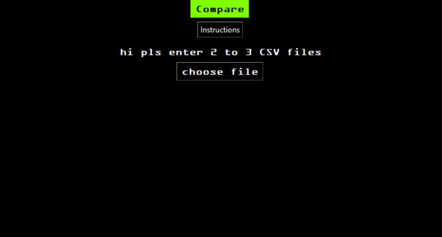
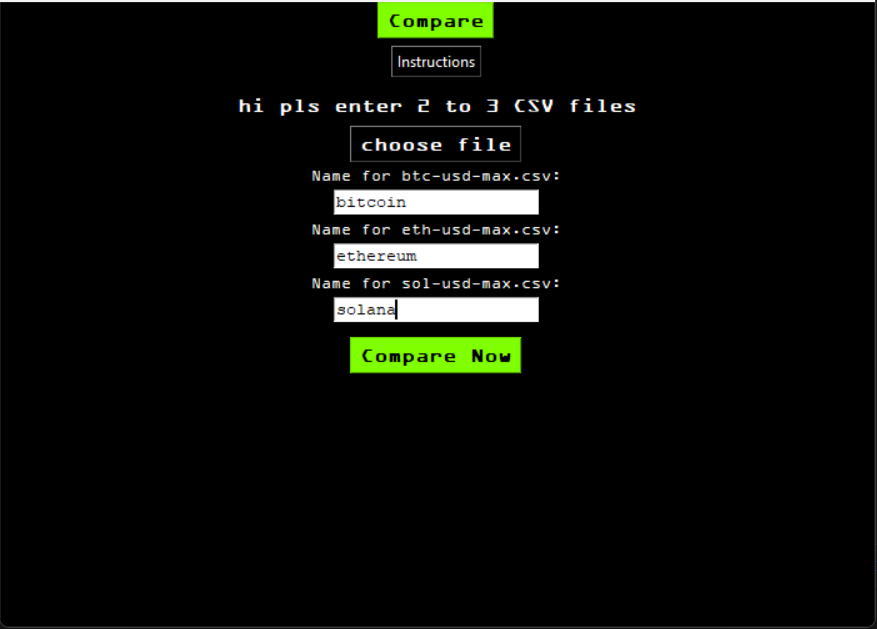
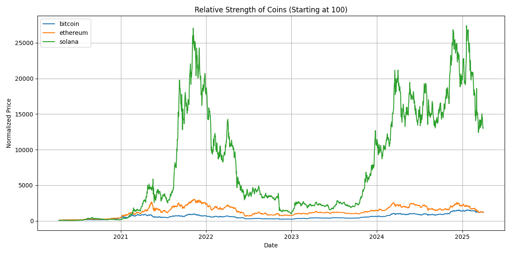
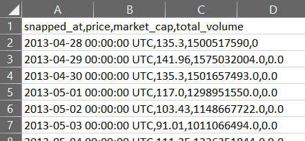

# RSI viewer
 Description: A Python desktop app to compare the Relative Strength of multiple cryptocurrencies using historical CSV data.

## What It Does

- Upload 2 or 3 CSV files of crypto price history
- Type the name for each coin (e.g., Bitcoin, Solana)
- Visualize how they performed over time, normalized to 100
- Great for spotting outperformers using Relative Strength

## How to Use It

2. Click the **Compare** button  
   


1. Upload 2 or 3 CSV files  
1. Type a custom name for each file  
   


1. Click **Compare Now** to see the chart!
   



- ✅ All data is processed using `pandas`
- ✅ Charts are built using `matplotlib`
- ✅ Built with `tkinter` for GUI

## Example CSV Format



## How I Tested It

- Used `pytest` to test data-cleaning and normalization functions
- Built sample test cases for merging and chart input

## Requirements

- Python 3.10+
- `pandas` (for data processing)
- `matplotlib` (for charts)
- pytest (for testing)
- Tkinter (for GUI)

Install with:
```bash
pip install -r requirements.txt
```
## Inspiration

Built as my **CS50 final project**.
Inspired by the need to visualize relative crypto performance without using paid APIs.

---
